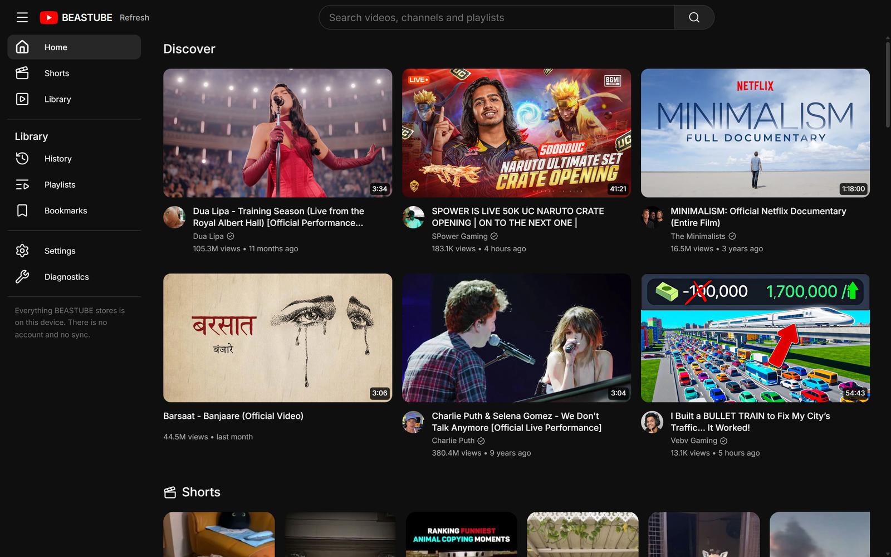
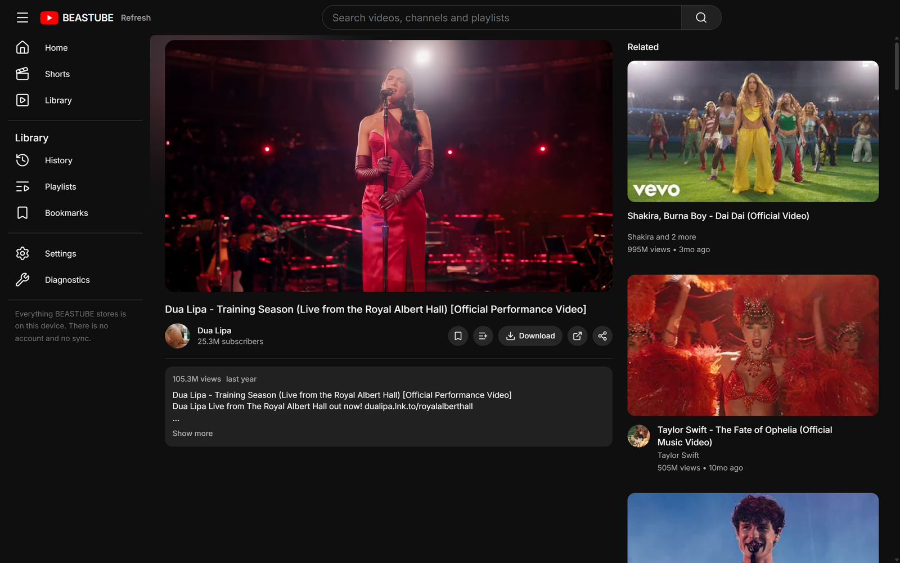
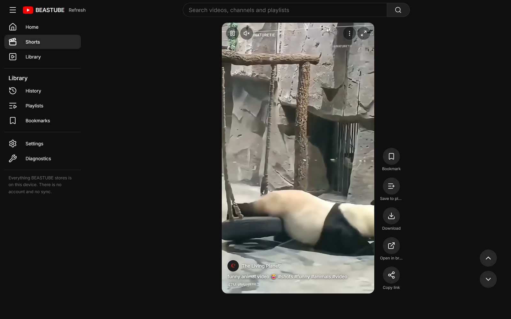
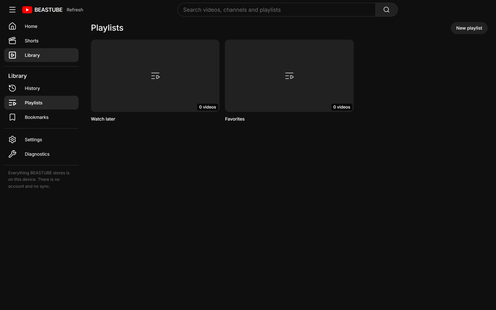
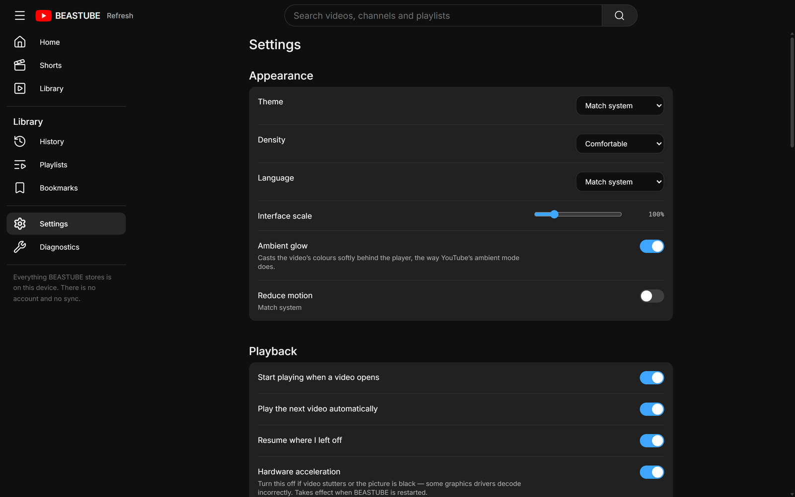

<div align="center">


# BEASTUBE

**A desktop YouTube client for Windows that keeps what you watch on your own machine.**

[](https://github.com/BEASTUBE/beastube/actions/workflows/ci.yml)
[](https://github.com/BEASTUBE/beastube/releases/latest)
[](https://github.com/BEASTUBE/beastube/releases)
[](LICENSE)
[](https://github.com/BEASTUBE/beastube/releases/latest)

No account. No sync. Nothing sent anywhere.

</div>

<div align="center">
  
</div>

---

## Contents

- [What it is](#what-it-is)
- [Installation](#installation)
  - [Release files](#release-files)
  - [Updating](#updating)
  - [Uninstalling](#uninstalling)
- [Features](#features)
  - [Watching](#watching)
  - [Shorts](#shorts)
  - [Your library](#your-library)
  - [Downloads](#downloads)
  - [Settings](#settings)
- [What is stored, and where](#what-is-stored-and-where)
- [Building from source](#building-from-source)
- [Project layout](#project-layout)
- [Contributing](#contributing)
- [Third-party software](#third-party-software)
- [Licence](#licence)

---

## What it is

BEASTUBE is a native Windows application for watching YouTube. It is not a browser wrapper around
youtube.com and it is not a scraper pretending to be one: playback goes through YouTube's own
sanctioned embed, wrapped in the application's own dark controls.

What makes it different is what it does **not** do. There is no account to sign into, no telemetry,
and no server of ours anywhere in the picture. Your history, playlists, bookmarks and watch
positions live in a SQLite file on your disk and are never uploaded.

Built with [Tauri 2](https://tauri.app) — a Rust core with a React front end, compiled to a single
native binary. It is not Electron; the installed application is around 24 MB of program.

## Installation

Download **`BEASTUBE_<version>_x64-setup.exe`** from the
[latest release](https://github.com/BEASTUBE/beastube/releases/latest) and run it.

That is the whole of it. The installer carries `yt-dlp` and `ffmpeg`, so downloads work on a machine
you have not prepared, and it installs the WebView2 runtime if Windows does not already have it
(Windows 11 always does).

**Requirements:** Windows 10 (1809 or newer) or Windows 11, 64-bit. About 250 MB of disk.

### Release files

| File                                   | Description                                                      |
| -------------------------------------- | ---------------------------------------------------------------- |
| **`BEASTUBE_<version>_x64-setup.exe`** | **The installer. This is the one you want.**                     |
| `BEASTUBE_<version>_x64-setup.exe.sig` | Signature for the file above, used by the built-in updater.      |
| `latest.json`                          | Update manifest. Installed copies read this; you do not need it. |

Every release is signed with the project's updater key. The public half is compiled into the
application, so a build will refuse an update it cannot verify — including one we did not sign.

### Updating

BEASTUBE updates itself. **Settings → About → Check for updates** fetches the next installer,
verifies its signature, and installs it without a wizard.

It is a full installer each time rather than a patch, because Windows offers no delta mechanism on
this path — around 50 MB, most of which is ffmpeg. The settings row says so before you press it.

### Uninstalling

Through **Settings → Apps** in Windows, or the `uninstall.exe` beside the program. Your library is
left in place; see [What is stored, and where](#what-is-stored-and-where) if you want it gone too.

## Features

### Watching

<div align="center">
  
</div>

The player wears the application's controls rather than YouTube's, and the quality selector is real:
**360p through 2160p, at 60fps where the video has it.** The embed picks its rendition from the size
of its own viewport, so a tier is requested by laying the frame out at that tier's true pixel width
and scaling the result back down — live, without a reload, in either direction. The reasoning and
the measurements are in
[ADR-0004](docs/architecture-decisions/0004-player-quality.md).

Also here: real subtitles with language selection, playback speed, chapters, resume-where-you-left-
off, and a related rail that gets out of the way when the window is too narrow to earn it.

### Shorts

<div align="center">
  
</div>

A full-height vertical feed with keyboard and wheel navigation, in the portrait shape shorts are
actually made in.

### Your library

<div align="center">
  
</div>

History, playlists, bookmarks and watch positions, all local. History can be searched, and entries
removed one at a time from the card menu. Incognito leaves no trace at all.

### Downloads

Videos can be saved to disk with the bundled `yt-dlp`, joined by the bundled `ffmpeg`. Neither has
to be installed separately and neither is vendored into this repository — the installer fetches them
at build time, each verified against a vendor checksum.

### Settings

<div align="center">
  
</div>

Theme (dark, light, AMOLED, or follow Windows), interface scale, density, reduced motion, default
and maximum quality, seek steps, subtitle language, download location, and a hardware-acceleration
switch for machines whose graphics driver renders video incorrectly.

There is a **Diagnostics** screen too: version, runtime, storage sizes and filtering counters, read
from your own machine, with a copy button. Nothing on it is transmitted anywhere.

## What is stored, and where

Everything is in one folder:

```
%APPDATA%\app.beastube.desktop\library.db
```

That SQLite file holds your history, playlists, bookmarks and watch positions. Delete it and
BEASTUBE starts as though freshly installed. Nothing else about you exists anywhere — there is no
account, no identifier, and no request that carries who you are.

## Building from source

Requires [Rust](https://rustup.rs), [Node](https://nodejs.org) 22.12+ with [pnpm](https://pnpm.io),
and the WebView2 runtime.

```powershell
pnpm install
pnpm tools:fetch     # downloads yt-dlp and ffmpeg, each verified against a vendor checksum
pnpm tauri dev       # run it
pnpm tauri build     # produce the installer
```

`pnpm tools:fetch` is not optional for a bundled build: the two executables it downloads are
installer resources, and downloads above roughly 360p cannot be produced without ffmpeg, because
YouTube serves no combined audio-and-video stream at those sizes.

The build lands at `target/release/bundle/nsis/BEASTUBE_<version>_x64-setup.exe` and contains only
compiled artefacts — the Rust binary with the minified front end embedded, plus the two tools. No
source is distributed.

### Checks

```powershell
pnpm typecheck       # tsc, strict, with exactOptionalPropertyTypes
pnpm lint            # eslint, zero warnings tolerated
pnpm format:check    # prettier
pnpm test            # vitest
cargo clippy --workspace --all-targets -- -D warnings
cargo test --workspace
```

## Project layout

| Path                           | What lives there                                                 |
| ------------------------------ | ---------------------------------------------------------------- |
| `src/`                         | React front end — views, stores, services, i18n catalogues       |
| `src-tauri/`                   | The desktop shell: window setup, IPC commands, logging           |
| `crates/beastube-core`         | Domain model and settings, shared by everything below            |
| `crates/beastube-db`           | SQLite storage and migrations                                    |
| `crates/beastube-provider*`    | Fetching from YouTube, and the traits that keep that swappable   |
| `crates/beastube-download`     | Driving `yt-dlp` as a child process                              |
| `docs/architecture-decisions/` | Why things are the way they are, with the measurements behind it |

The architecture decision records are worth reading before changing playback or downloads. Both
have non-obvious constraints that were measured rather than assumed.

## Contributing

Bug reports and pull requests are welcome. [`CONTRIBUTING.md`](CONTRIBUTING.md) covers the setup, the
checks, and the few things this codebase is strict about — chiefly that a control which does nothing
is treated as a bug, and that a claim about performance comes with the measurement behind it.

For anything security-shaped, read [`SECURITY.md`](SECURITY.md) and report it privately rather than
in an issue. Release steps and the signing key are in [`docs/RELEASING.md`](docs/RELEASING.md); what
changed in each version is in [`CHANGELOG.md`](CHANGELOG.md).

## Third-party software

[`yt-dlp`](https://github.com/yt-dlp/yt-dlp) (Unlicense) and [`ffmpeg`](https://ffmpeg.org)
(GPL v3) are bundled with the installer and run as separate processes. Neither is vendored into this
repository. See [`THIRD-PARTY-NOTICES.md`](THIRD-PARTY-NOTICES.md).

BEASTUBE is not affiliated with, endorsed by, or sponsored by YouTube or Google.

## Licence

GNU General Public License v3.0 or later. The full text is in [`LICENSE`](LICENSE).

GPL is also the licence the bundled ffmpeg is under, so the two agree rather than pulling against
each other. See [`THIRD-PARTY-NOTICES.md`](THIRD-PARTY-NOTICES.md) for what that means in practice
and where the corresponding source lives.
